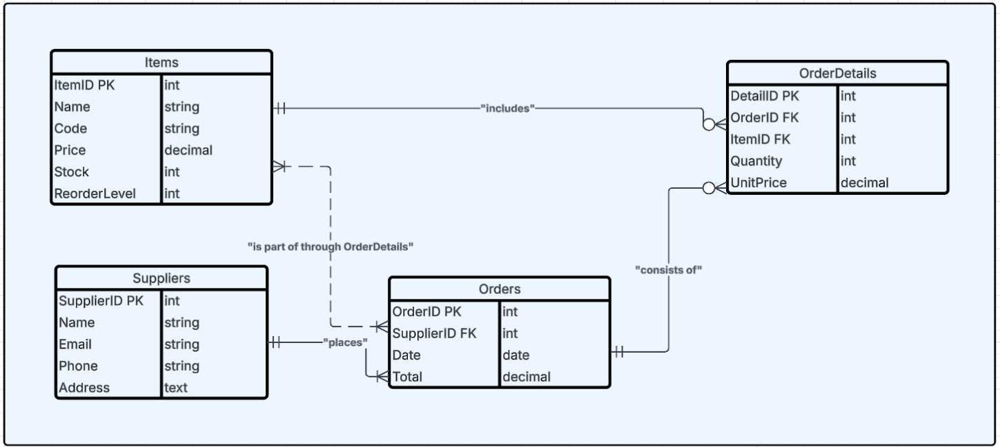

# 📊 Inventory Tracking System

## 📝 Description
This is the **Week 8 Assignment** for Database Design. It implements a simple **Inventory Tracking System** using MySQL. The system includes tables for managing items, suppliers, orders, and order details, with proper relationships and constraints.

## 🚀 How to Run
1. Open **MySQL Workbench** or any SQL client.
2. Import the `answers.sql` file:
   - Copy the SQL script from `answers.sql`.
   - Paste it into your SQL editor.
   - Execute the script to create the database and tables.
3. (Optional) Add sample data using `INSERT INTO` statements to test the database.

## 📂 Files
- **`answers.sql`**: Contains the SQL schema for the database, including `CREATE TABLE` statements and relationships.
- **ERD Screenshot**: Visual representation of the database structure.

## 🛠️ Features
- **Relational Database Design**:
  - Tracks inventory items, suppliers, and orders.
  - Includes relationships: One-to-Many (1-M) and Many-to-Many (M-M).
- **Well-Structured Schema**:
  - Primary Keys, Foreign Keys, and Constraints (e.g., `NOT NULL`, `UNIQUE`, `CHECK`).

## 📸 ERD Screenshot

## 📧 Contact
For feedback, feel free to reach out! 😊

